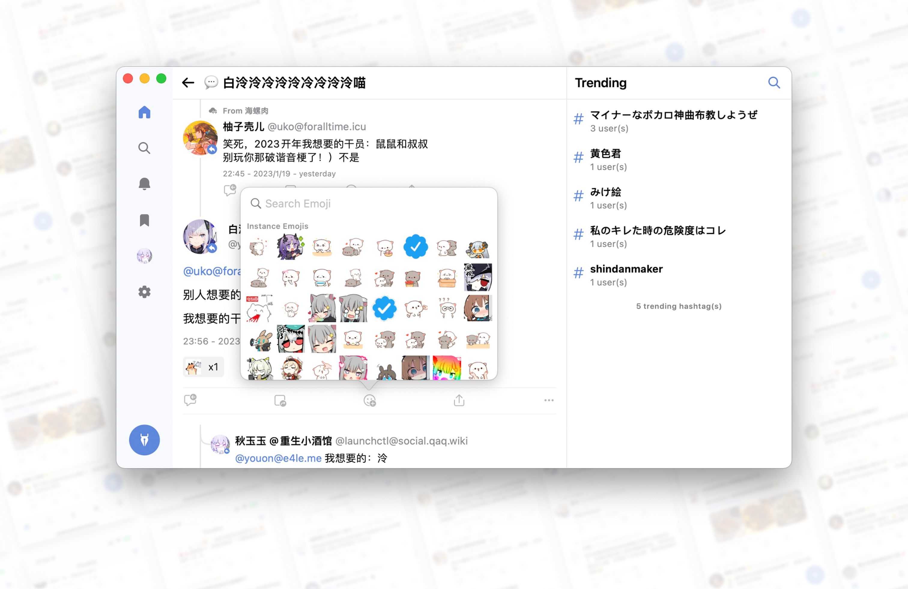

# Kimis

Kimis is a client for [Misskey](https://github.com/misskey-dev/misskey) built with pure UIKit for quality.

Full source code will be committed later after App Store submission approved. Contact me if you are in hurry.

## 👀 Preview

## 🌟 Key Features

- [x] **any instance running Misskey 13 +**
- [x] supports iOS/iPadOS 14.0+, macOS 11.0+
- [x] supports iPhone/iPad/Mac with platform optimization
- [x] better algorithm for timeline
- [x] high performance tableview smooth scrolling
- [x] mute will also filter username
- [x] smooth experience editing post
- [x] clear and simple UI
- [x] supports dark mode
- [ ] supports multiple accounts
- [ ] chat support
- [ ] i18n (currently English only)

Previously, Kimis supports all instance from Misskey 12+, but due to the change of emoji API, Kimis now only supports Misskey 13+. You can still login to Misskey 12+ instance, but you will not be able to see emoji.

## 🤪 Badge

~~No SwiftUI, No ChatGPT, you deserve better.~~

## 🧑‍⚖️ License

[MIT License - Kimis Edition](./LICENSE) 

TLDR:

- [x] no copyright notice required
- [x] no permission notice required
- [x] no warranty
- [x] no App Store submission (not allowed)

The icon is drawn by Dall·E, additional license may apply.

## 🥰 Thanks

Thanks to all of my friends who helped me test Kimis, and thanks to all of the contributors of Misskey. Although I have complained about Misskey a lot, I still love it.

Made with ❤️ by [@Lakr233](https://twitter.com/@Lakr233) and his friends [@unixzii](https://twitter.com/@unixzii) [@NekoyueW](https://twitter.com/@NekoyueW).

---

Copyright © 2022 Lakr Aream. All Rights Reserved.
